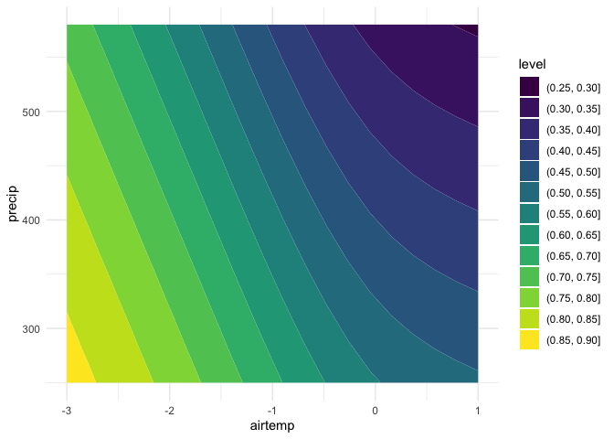

<!-- README.md is generated from README.Rmd. Please edit that file -->

# csmp

<!-- badges: start -->

<!-- badges: end -->

The goal of the **csmp** package is to assess the climate sensitivity of
model performance, as described in Marshall et al. (2021). Please see
the manuscript for more details about use and applications.

## Installation

You can install csmp from [GitHub](https://github.com/) with:

``` r
# install.packages("devtools") # if devtools is not already installed
devtools::install_github("adrienne-marshall/csmp", ref = 'main') # ref needed for older versions of devtools
```

## Examples

We can evaluate the model performance, as represented by an objective
function (e.g., RMSE), in different climatic contexts. Each value in the
objective function vector represents model performance in the
corresponding air temperature and precipitation vectors. In the
following example, air temperature, precipitation, and the objective
function are all random vectors representing hypothetical annual mean
air temperature, annual precipitation, and the model performance in a
given year.

``` r
library(csmp)
set.seed(10)
airtemp <- rnorm(20, mean = 0, sd = 1)
precip <- rnorm(20, mean = 500, sd = 100)
objective <- rbeta(20, 1, 1)

ans <- csmp(airtemp, precip, objective, return_plot = TRUE)
ans$stats
#>      rsquared p_airtemp  p_precip   csmp_warm csmp_cool   csmp_dry    csmp_wet
#> 3 -0.02086214 0.2880655 0.3052486 -0.04896074 0.1660792 0.09383768 -0.07572375
ans$contour_plot 
```



In this example, R<sup>2</sup> is close to 0, and the p-values indicate
a lack of statistical significance for the effects of air temperature or
precipitation. This makes sense, given that we used random data to
generate these values, and is important to evaluate in real use
contexts.

The output contour plot can be modified with standard ggplot commands:

``` r
library(ggplot2)
ans$contour_plot + 
  labs(fill = "Objective\nfunction",
       x = "Air temperature (°C)",
       y = "Precipitation (mm)")
```


The `new_airtemp` and `new_precip` parameters represent the conditions
under which to compare the change in model performance. For example, for
evaluation of model performance in a 2 °C warming scenario,
`new_airtemp` should be 2 °C warmer than historical average air
temperature (which can be specified with the `ref_airtemp` parameter or
inferred based on the supplied vector of air temperature observations).
`new_airtemp` and `new_precip` can each be vectors of length one
(representing unidirectional change in climate) or two (to evaluate,
e.g., potential changes due to wetting or drying).

In this example, we modify the new values of air temperature and
precipitation. Keep in mind the model will be most reliable if
predictions are within the range of observed variability.

``` r
ans <- csmp(airtemp, precip, objective,
            return_plot = TRUE,
            new_airtemp = c(-4, 4),
            new_precip = c(100, 800))
ans$stats
#>      rsquared p_airtemp  p_precip  csmp_warm csmp_cool  csmp_dry   csmp_wet
#> 3 -0.02086214 0.2880655 0.3052486 -0.1262378 0.4482555 0.2178011 -0.2212498
```

# References

Marshall, A. M., Link, T. E., Flerchinger, G. N., Nicolsky, D. J., &
Lucash, M. S. (2021). Ecohydrological modeling in a deciduous boreal
forest: Model evaluation for application in non-stationary climates.
*_Hydrological Processes_*, n/a(n/a), e14251.
<https://doi.org/10.1002/hyp.14251>
